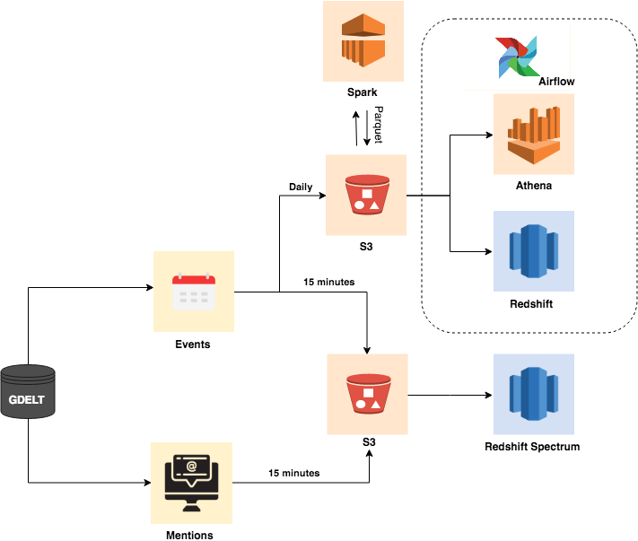
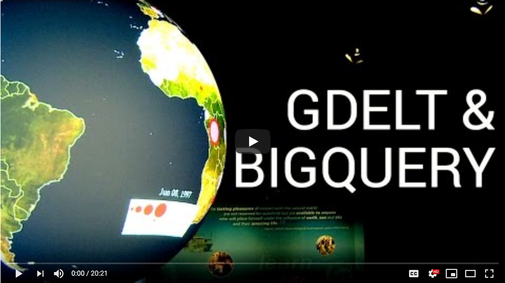
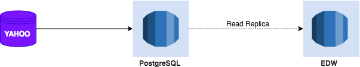
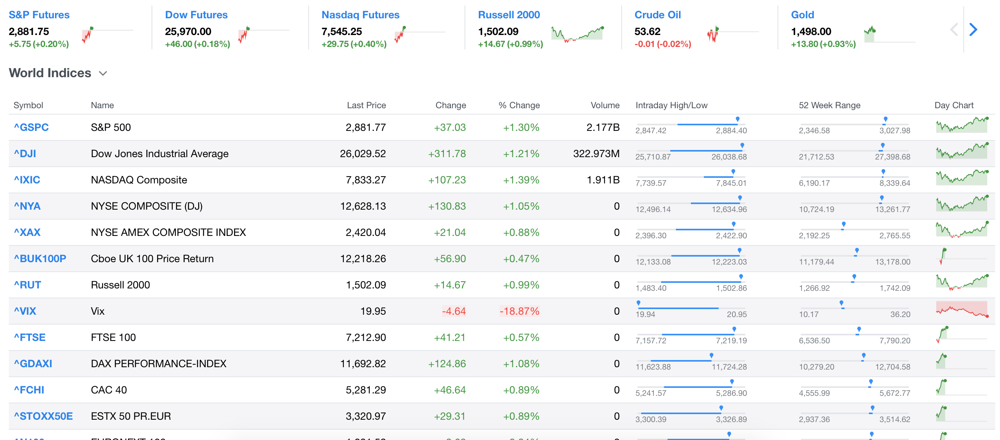
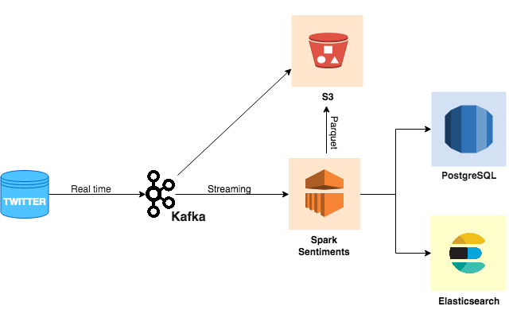

# GDELT, Yahoo and Twitter stream

This is a demonstration on how to extract the public data across the world, feed it into data pipelines, and perform ETL/ELT as shown in each section diagram.

## Environments

* AWS
* Terraform
* S3
* Apache Kafka
* Apache Airflow
* Apache Spark
* Amazon Redshift
* Athena/Presto
* PostgreSQL
* ElasticSearch
* Docker

## Set up environments

* [Setup](https://github.com/tharid007/gdelt/tree/master/setup)

## GDELT

According to [GDELT website](https://blog.gdeltproject.org/gdelt-2-0-our-global-world-in-realtime/), GDELT dataset is one of the largest and most ambitious platforms ever created for monitoring our global world. From realtime translation of the world’s news in 65 languages, to measurement of more than 2,300 emotions and themes from every article, to a massive inventory of the media of the non-Western world.

Many organizations have been using GDELT as the complementary datasets to enchance more new signals for their machine learning models. For example, [stock prices prediction](https://opensiuc.lib.siu.edu/theses/2178/), and [predicting community engagement](https://cloud.google.com/blog/products/gcp/predicting-community-engagement-on-reddit-using-tensorflow-gdelt-and-cloud-dataflow-part-1)

In this project, I've downloaded both 15 minutes update "events" and "mentions" directly from [GDELT](http://data.gdeltproject.org/gdeltv2/lastupdate.txt) and also scheduled scripts to download every 15 minutes automatically before uploading to S3 data lake so that Spectrum and Athena are able to query on top of S3.

You can see the actual code and read more information at:

* [gdelt-data](https://github.com/tharid007/gdelt/tree/master/gdelt-data)

Besides, AWS has been uploading GDELT events to [AWS S3 registry](https://registry.opendata.aws/gdelt/) everyday. Thus, we don't have to create scraping scripts to download the historical GDELT events by ourselves. I decided to use Apache Airflow as a glue between my custom code and AWS services.

You can see the actual code and read more information at:

* [gdelt-utils](https://github.com/tharid007/gdelt/tree/master/setup#gdelt-utils)
* [gdelt-parquet](https://github.com/tharid007/gdelt/tree/master/gdelt-parquet)

## Yahoo finance

Back then, yahoo used to provide the Yahoo finance API for getting the market data. Unfortunately, it has been deprecated and cannot access anymore. So, I decided to write a little script that scrapes the [Yahoo finance](https://finance.yahoo.com/) and ingests data into PostgreSQL for us.

You can see the actual code and read more information at:
* [yahoo](https://github.com/tharid007/gdelt/tree/master/yahoo)

> Read replica is not required. You can execute it with `terraform apply -target module.yahoo_db_replica` for better performance.

## Twitter real time stream
 

The [Twitter API](https://developer.twitter.com/en/docs/basics/getting-started) platform offers the way to stream realtime tweets which is nice because we can now capture the people sentiment in real time.

You can see the actual code and read more information at:
* [twitter](https://github.com/tharid007/gdelt/tree/master/twitter)
