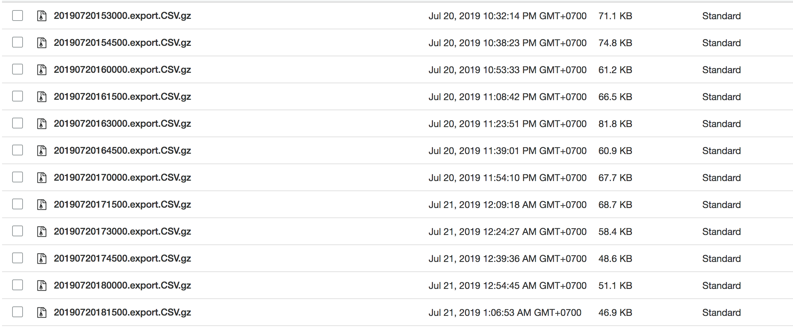

# GDELT 15 minutes update data
Downloading latest events and mentions from GDELT and upload them to AWS S3.




## Getting Started
Before executing scripts, AWS credential is needed:

```
export AWS_ACCESS_KEY_ID=xxxxxxxxxxxxx
export AWS_SECRET_ACCESS_KEY=xxxxxxxxxxxxxx
```
### Running a single container
1. `cd event && docker build -t event .`
2. `docker run --name event -d -e AWS_ACCESS_KEY_ID=$AWS_ACCESS_KEY_ID -e AWS_SECRET_ACCESS_KEY=$AWS_SECRET_ACCESS_KEY -v /Users/john/gdelt/event:/gdelt event`

### Running with docker-compose
1. `docker-compose -f docker-compose-dev.yml up --build -d`

### Running without docker
1. `nohup bash mention/mention.sh &`
2. `nohup bash event/event.sh &`


### Pushing to AWS ECR 
1. `cd mention && docker build -t mention .`
2. `docker tag mention 111111111111.dkr.ecr.ap-southeast-1.amazonaws.com/mention`
3. `eval $(aws ecr get-login  --no-include-email)`
4. `aws ecr create-repository --repository-name mention`
5. `docker push 111111111111.dkr.ecr.ap-southeast-1.amazonaws.com/mention`
