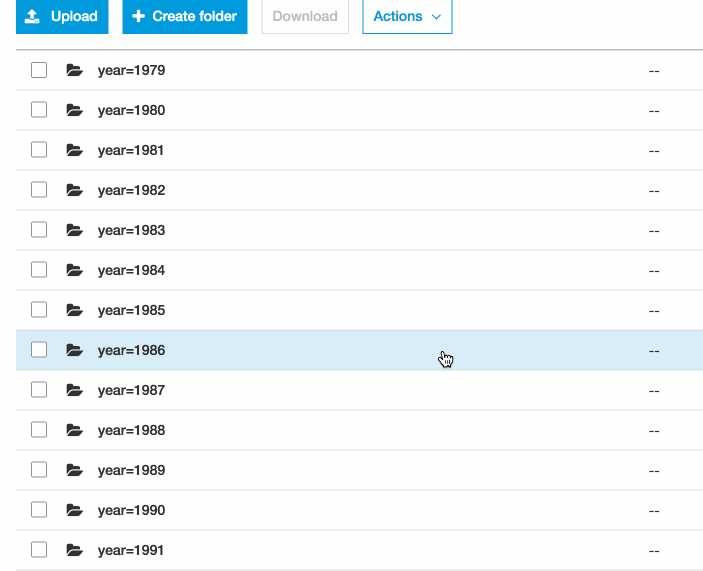

# Converting GDELT S3 to Parquet

This Spark code will get the GDELT data from [AWS S3 registry](https://registry.opendata.aws/gdelt/) and automatically convert them into Parquet partitions by year, month and day.



## Why Parquet ?

* Improves query performance because of columnar storage format
* Lower scanning costs when using Athena and Redshift Spectrum
* Saves S3 storage costs


## Verify AWS S3 data sources
```
$ aws s3 ls s3://gdelt-open-data/events/ --recursive --human-readable --summarize
```

## Local development
1. Package with `sbt package` 
2. `$ bin/spark-submit --class "com.example.SparkParquet"  ~/Desktop/master/gdelt/spark-src/target/scala-2.12/sparkparquet_2.12-0.3.jar` 
3. You can pass any date as an argument like `20190727` to specify certain date


#### Launching EMR with JAR file

* Upload the JAR file to S3:

```
$ aws s3 cp ~/Desktop/master/gdelt/gdelt-parquet/target/scala-2.12/sparkparquet_2.12-0.3.jar s3://gdelt-tharid
```

* Create Spark cluster via aws-cli:

```
$ aws emr create-cluster --name "Gdelt Parquet" --log-uri s3://gdelt-tharid/emr-logs --release-label emr-5.24.0 --applications Name=Spark \
--ec2-attributes KeyName=test_key --instance-type m4.2xlarge --instance-count 11 \
--steps Type=Spark,Name="Spark Parquet",ActionOnFailure=TERMINATE_CLUSTER,Args=[--master,yarn,--deploy-mode,cluster,--class,com.example.SparkParquet,s3://gdelt-tharid/sparkparquet_2.12-0.3.jar] --use-default-roles --auto-terminate --configurations file://./myConfig.json
```

_Note: if you have not previously created the default Amazon EMR service role and EC2 instance profile, run `aws emr create-default-roles` to create them before typing the `create-cluster` subcommand._

_Note2: In case of `no matches` error in your terminal, run `setopt nonomatch`._

> To get the best performance from your cluster, I highly recommend reading this [post](https://aws.amazon.com/blogs/big-data/best-practices-for-successfully-managing-memory-for-apache-spark-applications-on-amazon-emr/) which clearly explains how to optimize and tune proper configurations for the Spark cluster. In this case, I set `maximizeResourceAllocation` to `true` in `myConfig.json`.


> To access Spark web UI, follow this [documentation](https://docs.aws.amazon.com/emr/latest/ManagementGuide/emr-ssh-tunnel-local.html) by using local port forwarding and FoxyProxy


