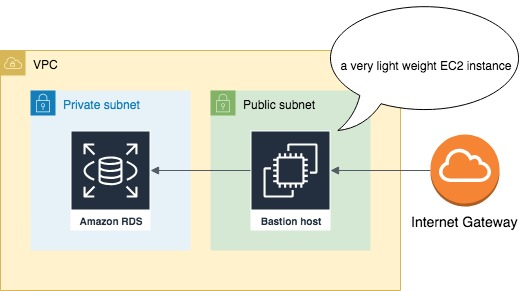
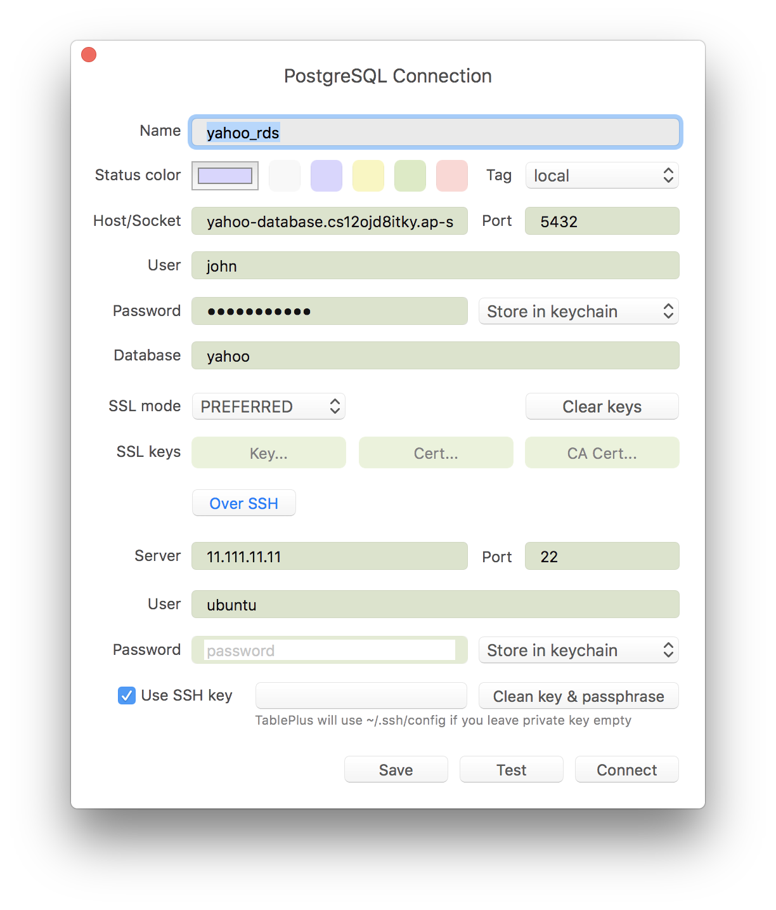
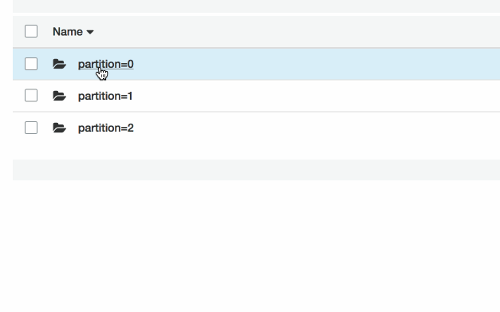
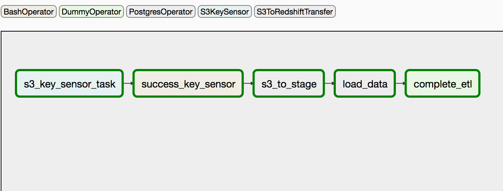
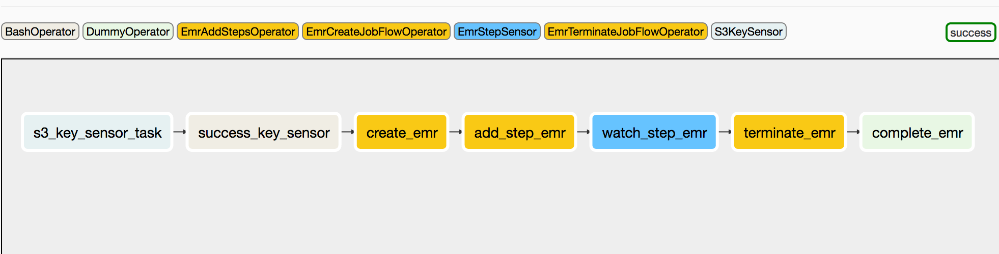

# Setup AWS


## Terraform
Every resource has been wrapped as the module for easiness and management. Besides, `makefile` is used to manage Terrafrom states which is easier than manual duck typing.

Terraform has 3 steps:

1. `terraform init`
2. `terraform plan`
3. `terraform apply`

For example, to setup VPC with 3 public subnets, 3 private subnets and NAT gateway: 
```
$ terraform apply -target module.vpc -target module.ec2_profile -auto-approve
```

### Setup Main S3 bucket

```
# create new bucket
aws s3 mb s3://gdelt-tharid
# copy every csv file to bucket
aws s3 cp --recursive ./csv s3://gdelt-tharid/

```

### Setup bastion instance
Because of deploying in VPC with both private and public subnets,  inevitably, bastion instance is used as the jumping host for accessing nodes in all private subnets



For instance: 
```
$ terraform apply -target module.bastion -target module.yahoo_db -auto-approve

# local forward port by securely connecting through ssh pipeline
$ ssh -i test_key.pem -N -L 5555:spark-database.xxxxxxxxxxxx.ap-southeast-1.rds.amazonaws.com:5432 ubuntu@11.111.11.111
```

Some SQL clients like [TablePlus](https://tableplus.com/) supports ssh tunnel out of the box.



### Setup docker
Docker has to:
* Use [shell scripts](https://github.com/tharidlynn/gdelt/tree/master/gdelt-data) to get both GDELT events and mentions
* Stream twitter with [JAR](https://github.com/tharidlynn/gdelt/tree/master/twitter)
* Scrape [yahoo finance](https://github.com/tharidlynn/gdelt/tree/master/yahoo)

I decided to use a plain docker installed on EC2 instance and avoided all heavy container orchestrations such as Kubernetes and ECS because of another complexity of layer on top of this side project.

For all data sources, I have wrapped everything in container and push to AWS ECR. 

`$ terraform apply -target module.docker`

### Setup Kafka connector and create topic
I use [Kafka Connect Amazon S3](https://docs.confluent.io/current/connect/kafka-connect-s3/index.html) to consume Twitter streaming data and push raw files back to S3.




`$ terraform apply -target module.kafka_connect -auto-approve` installs Kafka package, moves neccessary files to the instance and automatically configurates files for us. However, you still have to set up below scripts manually. 

```
# unzip kafka-connect-s3
$ aws s3 cp s3://tharid/confluentinc-kafka-connect-s3-5.2.2.zip . && unzip confluentinc-kafka-connect-s3-5.2.2.zip -d /usr/local/share/kafka/plugins/

# place config files to the right place
$ cp ~/connect-standalone.properties ~/s3-sink-twitter.properties kafka_2.12-2.1.0/config

# create kafka topic, https://docs.aws.amazon.com/msk/latest/developerguide/msk-get-bootstrap-brokers.html

$ aws kafka list-clusters

$ bin/kafka-topics.sh --create --zookeeper 10.0.103.160:2181,10.0.101.122:2181,10.0.102.132:2181 --replication-factor 1 --partitions 3 --topic twitter

$ bin/kafka-topics.sh --create --zookeeper 10.0.103.160:2181,10.0.101.122:2181,10.0.102.132:2181 --replication-factor 1 --partitions 3 --topic twitter-sen

# start kafka connect and consume kafka topic/produce to s3 bucket
$ ./bin/connect-standalone.sh config/connect-standalone.properties config/s3-sink-twitter.properties
```

_Note: I uploaded kakfa-connect-s3 to my private S3 bucket. Feel free to use whatever method you are familiar with such as `scp`._

## GDELT utils

### Redshift scripts

Get the GDELT data from [AWS S3 registry](https://registry.opendata.aws/gdelt/) and bulk loading to Redshift.

> Tip: exposing your aws credential is bad, I recommend creating a new IAM Role and attach it to your Redshift cluster https://docs.aws.amazon.com/redshift/latest/mgmt/authorizing-redshift-service.html

* Create tables: `redshift-scripts/create_tables.sql`
* Copy GDELT from S3 registry and look-up data to Redshift: `redshift-scripts/copy_to_tables.sql`
* Create Spectrum mention table to read [gdelt-data](https://github.com/tharidlynn/gdelt/tree/master/gdelt-data): `redshift-scripts/create_mention_table.sql`

Without Airflow, Spectrum is faster (blur data lake/data warehouse) due to zero ETL.

### Athena scripts

Querying GDELT data on top of S3 with Athena (serverless of Presto).

* For the best performance, use Spark to convert to Parquet first with [gdelt-parquet](https://github.com/tharidlynn/gdelt/tree/master/gdelt-parquet)
* Create csv table: `athena-scripts/create_tables.sql`
* Create parquet table: `athena-scripts/create_parquet_tables.sql`
* Some example queries: `athena-scripts/sql_queries.sql`

Obama query:

Before converting to Parquet: (Run time: 52.6 seconds, Data scanned: 186.87 GB)

After converting to Parquet: (Run time: 19.97 seconds, Data scanned: 3.21 GB)


_SQL queries credit: https://github.com/juliensimon/aws/blob/master/athena/gdelt/sql_queries.txt_


### Incremental loads with Airflow

#### Setup Airflow

1. Start airflow server 

```
airflow initdb
nohup airflow webserver -p 8080& 
nohup airflow scheduler&
```

2. Copy `dags` from local machine to prod

```
scp -i test_key.pem -r dags ubuntu@11.111.11.111:~/.
```
3. Add all required connections in Airflow admin > connections

```
Aws connection
Conn id: conn_aws_id
Conn type: Amazon web services
Leave the rest blank and add extra:
{"aws_access_key_id":"xxxxxxxxxxxxx", "aws_secret_access_key": "xxxxxxxxxxxxx", "region_name": "ap-southeast-1"}

S3 connection
Conn id: conn_aws_s3
Conn type: s3
Leave the rest blank and add extra:
{"aws_access_key_id":"xxxxxxxxxxxxx", "aws_secret_access_key": "xxxxxxxxxxxxx"}

Redshift connection 
Note: schema = db_name
Conn id: conn_aws_redshift
Conn type: Postgres
host: 
port: 5439
schema: gdelt 
login: john
password: Password123

# read more info at: https://boto3.amazonaws.com/v1/documentation/api/latest/reference/services/emr.html

EMR connection
Conn id: conn_aws_emr
Conn type: Elastic Map Reduce
Leave the rest blank and add extra: (Boto client.run_job_flow style)
_Note: do not forget to fill the Ec2SubnetId_
                        
{
   "Name":"GDELT Incremental Parquet",
   "LogUri":"s3://gdelt-tharid/logs",
   "ReleaseLabel":"emr-5.24.0",
   "Instances":{
      "Ec2KeyName":"test_key",
      "Ec2SubnetId":"subnet-000",
      "InstanceGroups":[
         {
            "Name":"Master nodes",
            "Market":"ON_DEMAND",
            "InstanceRole":"MASTER",
            "InstanceType":"m4.xlarge",
            "InstanceCount":1
         },
         {
            "Name":"Slave nodes",
            "Market":"ON_DEMAND",
            "InstanceRole":"CORE",
            "InstanceType":"m4.xlarge",
            "InstanceCount":1
         }
      ],
      "TerminationProtected":false,
      "KeepJobFlowAliveWhenNoSteps":true
   },
   "Applications":[
      { "Name": "Spark" }
   ],
   "VisibleToAllUsers":true,
   "JobFlowRole":"EMR_EC2_DefaultRole",
   "ServiceRole":"EMR_DefaultRole",
   "Tags":[
      {
         "Key":"app",
         "Value":"analytics"
      },
      {
         "Key":"environment",
         "Value":"development"
      }
   ]
}

Athena connection
Conn id: conn_aws_athena
Conn type: Amazob Web Services
Leave the rest blank and add extra:
{"aws_access_key_id":"xxxxxxxxxxxxx", "aws_secret_access_key": "xxxxxxxxxxxxx", "region_name": "ap-southeast-1"}
```


#### Redshift ETL
* [dags/gdelt_redshift.py](https://github.com/tharidlynn/gdelt/blob/master/setup/dags/gdelt_redshift.py)

Incremental Redshift loading using Airflow scheduler daily with S3 sensor. When the new file is detected, it will automatically load to our Redshift cluster.


#### Athena ETL
* [dags/gdelt_parquet.py](https://github.com/tharidlynn/gdelt/blob/master/setup/dags/gdelt_parquet.py)



Automaically converting new S3 csv file to Parquet partitions using daily Airflow scheduler with S3 sensor. When the new file is detected, it will spin EMR cluster and use Spark code from []() to convert and upload to S3 target.


