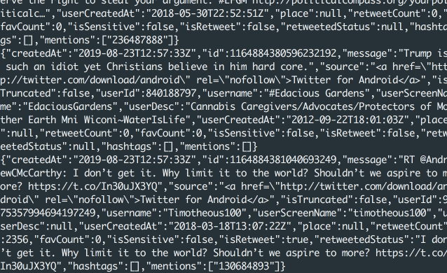
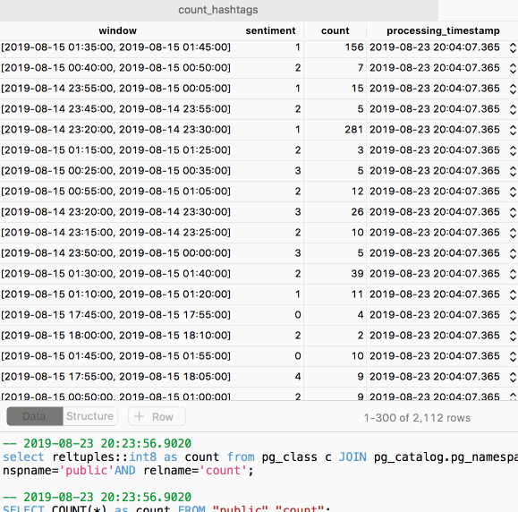
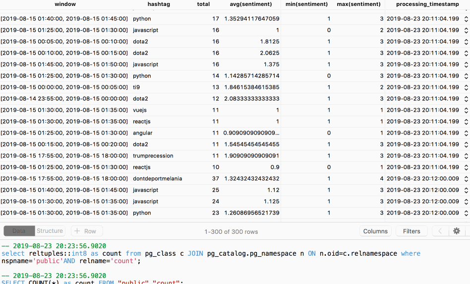
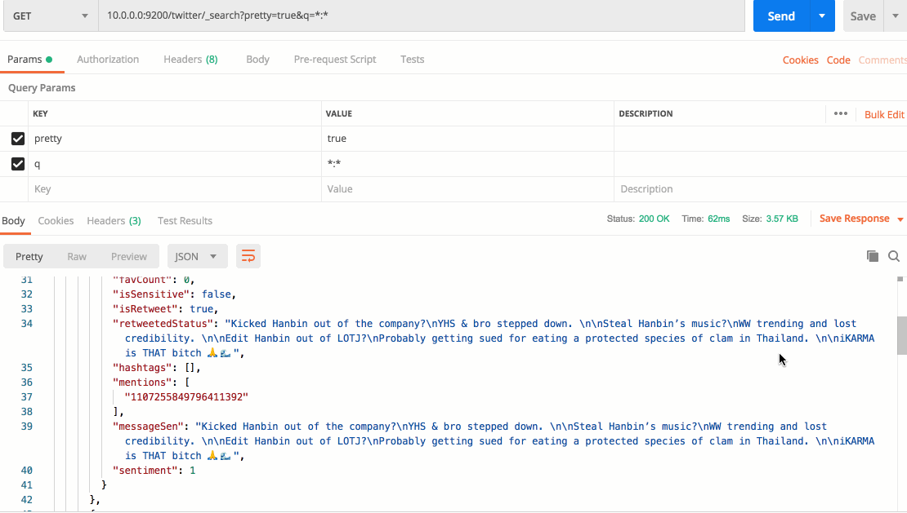

# Real time Twitter stream


## Dependencies

* [twitter4j](http://twitter4j.org/en/)
* [kafka](https://kafka.apache.org/)
* [json4s](http://json4s.org/)

## Getting tweets to Kafka



1. Create an [Twitter app](https://developer.twitter.com/en/apps)

2. Build a fat JAR
```
$ sbt assembly
```

3. Build a container

```
$ docker build -t twitter:latest .
```
4. Update your `.env` and then `$ source .env`

5. After that, run docker:
```
$ docker run --name twitter --rm -d -e OAuthConsumerKey=$OAuthConsumerKey -e OAuthConsumerSecret=$OAuthConsumerSecret -e OAuthAccessToken=$OAuthAccessToken -e OAuthAccessTokenSecret=$OAuthAccessTokenSecret twitter:latest host.docker.internal:9092 twitter putin trump
```

* `host.docker.internal:9092`: the Kafka servers
* `twitter`: Kafka topic
* `putin trump`: keywords (you can pass multiple arguments) 


## Twitter consumer with Spark

This code uses [Spark Structured Streaming](https://spark.apache.org/docs/latest/structured-streaming-programming-guide.html) written in Scala which is a new concept devised in Spark 2.0.

Spark will consume the `twitter` topic and then perform sentiment analysis using [Stanford CoreNLP](https://github.com/databricks/spark-corenlp). After that, Spark will produce the results back to new Kafka topic so that other Spark consumers can independently consume it with their own pace.

### Other Spark streaming queries

* Count window sentiments in real time and stream the results to Postgres



* Aggregate hashtags statistics and stream the results to Postgres



* Ingest data to elasticsearch



* Convert data to Parquet and upload continuously to S3

> To get the best performance from your cluster, I recommend reading this [post](https://aws.amazon.com/blogs/big-data/best-practices-for-successfully-managing-memory-for-apache-spark-applications-on-amazon-emr/
) which clearly explains how to optimize and tune proper configurations for the Spark cluster.

> Do note that Spark streaming has to use the 'checkpoint' to guarantee the end-to-end fault-tolerance. In this case, I've enabled [EMRFS](https://docs.aws.amazon.com/emr/latest/ManagementGuide/emr-fs.html) via Terraform as the checkpoints instead of normal HDFS or S3 for better consistency and durability.

### Deploying Spark 

```
# build jar file and upload to s3
$ sbt assembly && aws s3 cp /Users/john/Desktop/master/gdelt/twitter/spark-consumer/target/scala-2.11/sparkConsumer-assembly-0.1.0-SNAPSHOT.jar s3://gdelt-tharid/

# upload postgres driver to s3
$ aws cp postgresql-42.2.6.jar s3://gdelt-tharid/
```

In EMR master node:

```
# download one of the language models
$ wget http://repo1.maven.org/maven2/edu/stanford/nlp/stanford-corenlp/3.9.1/stanford-corenlp-3.9.1-models.jar

# get the psql driver and jar (spark-submit supports jar file on s3)
$ aws s3 cp s3://gdelt-tharid/postgresql-42.2.6.jar . && aws s3 cp s3://gdelt-tharid/sparkConsumer-assembly-0.1.0-SNAPSHOT.jar .

# export driver path for spark
$ export MY_DRIVER_CLASS_PATH=postgresql-42.2.6.jar$(grep spark.driver.extraClassPath /etc/spark/conf/spark-defaults.conf | awk '{print $2}')

# deploy spark with arguments <kafka host> <postgres target> <elastic target> <parquet target>
$ spark-submit --master yarn --deploy-mode cluster --driver-class-path $MY_DRIVER_CLASS_PATH --class twitter.TwitterConsumer --packages org.apache.spark:spark-sql-kafka-0-10_2.11:2.4.3 --jars stanford-corenlp-3.9.1-models.jar,postgresql-42.2.6.jar s3://gdelt-tharid/sparkConsumer-assembly-0.1.0-SNAPSHOT.jar  kafka1:9092,kafka2:9092,kafka3:9092 postgres-database-target elasticsearch-target s3://gdelt-tharid/twitter-parquet
```
