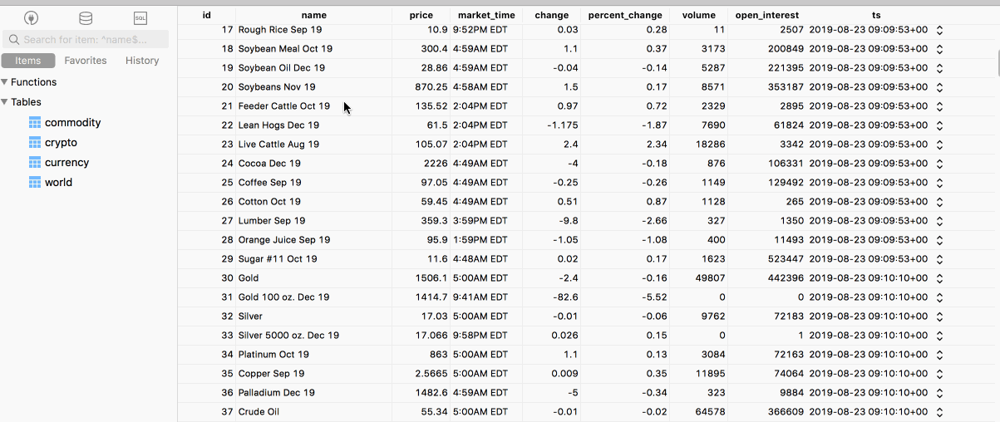

# Scraping Yahoo finance
Python scripts that scrape the [yahoo finance](https://finance.yahoo.com) and save to PostgreSQL every 15 seconds.


The following data will be scraped:
* world-indices
* commodities
* currencies
* cryptocurrencies



## Getting started without Docker

```
source .env
python create_db.py
python main.py
```

## Getting started with Dockerfile
_Note: the docker wraps `main.py` only._

```
source .env
python create_db.py
docker build . -t yahoo
docker run --name yahoo --rm -it -d -e PGHOST=$PGHOST -e PGDATABASE=$PGDATABASE -e PGUSERNAME=$PGUSERNAME -e PGPASSWORD=$PGPASSWORD yahoo
```
## Pushing to ECR

```
docker build . -t yahoo
docker tag yahoo 111111111111.dkr.ecr.ap-southeast-1.amazonaws.com/yahoo
eval $(aws ecr get-login  --no-include-email)
aws ecr create-repository --repository-name yahoo
docker push 111111111111.dkr.ecr.ap-southeast-1.amazonaws.com/yahoo
 ```

